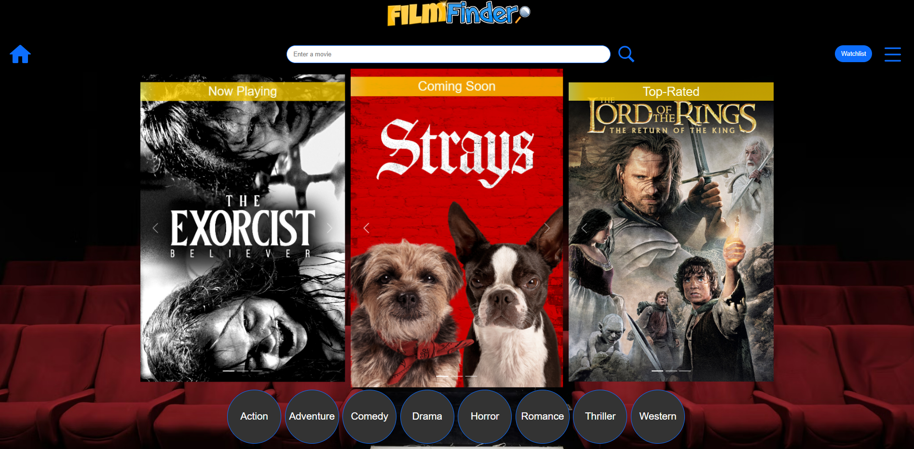

# FilmFinder

### Welcome to FilmFinder!

<strong>FilmFinder is a movie database web application that allows users to search for movies, view details about them, maintain a personalized watchlist, and discover the streaming platforms for each movie. The website features a clean and responsive UI for the user.</strong>

The website draws your attentions upon loading with unique branding and engaging carousels of movie posters. It was our vision to simulate browsing your local movie theatre when deciding what movie to watch. 

The user can then click any genre they are interested in and easily add movies to their watchlist. Upon adding to the watchlist, user can see information about the movie's plot and where they can stream it. 

It is our intention so that when the user has completed watching a movie, they can revisit their watchlist and remove items individually. All watchlist items are stored locally to provide a seamless experience for the end user. 

<strong>Tired of watching "The Office" for the 100th time? Try out FilmFinder and see what else is out there!</strong>

### Movie Search:
- <strong>Functionality:</strong> Users can enter the name of a movie in the search bar and click the "Search" button.
- <strong>API Integration:</strong> The application interacts with The Movie Database (TMDb) API to fetch information about movies based on the user's input.

### Watchlist:
- <strong>Add to Watchlist:</strong> Users can add movies to their watchlist by clicking the "Add to Watchlist" button on individual movie cards.
- <strong>Remove from Watchlist:</strong> Users can remove movies from their watchlist by clicking the "Remove from Watchlist" button on individual movie cards.
- <strong>Local Storage:</strong> The watchlist functionality uses the local storage of the user's browser to store and retrieve the list of movies.

### Movie Details:
- <strong>Details Page:</strong> Clicking on a movie card redirects the user to a detailed page for that movie.
- <strong>Information Provided:</strong> The details page displays comprehensive information about the selected movie, including its poster, title, tagline, release date, runtime, rating, and a description.
- <strong>Streaming Sources:</strong> The page also uses WatchMode API to provide information about where the movie can be streamed, enhancing user convenience.

### Genre Filtering:
- <strong>Genre Buttons:</strong> Users can filter movies by genre using genre buttons. Clicking on a genre button fetches and displays movies belonging to that genre.

### Responsive Design:
- <strong>Bootstrap Framework:</strong> The application utilizes the Bootstrap framework for styling, ensuring a responsive and visually appealing design.
- <strong>Cross-Device Compatibility:</strong> The responsive design ensures that the application is accessible and user-friendly on various devices, including desktops, tablets, and mobile phones.

### Code Structure:
- <strong>HTML, CSS, JavaScript:</strong> The project is structured using HTML for markup, CSS for styling, and JavaScript for dynamic functionalities.
- <strong>Modular Approach:</strong> The code is organized into separate files for different pages (e.g., index.html, movie-details.html) and functionalities, following a modular and maintainable structure.

## Link to the deployed URL below:

https://samm1911.github.io/Film-Finder/

## Screenshot of the website can be found below:

## Credits
- [TMDb API](https://developer.themoviedb.org/reference/intro/getting-started)
- [WatchMode API](https://api.watchmode.com/docs/#api-reference)
- [Font Awesome](https://fontawesome.com/icons)